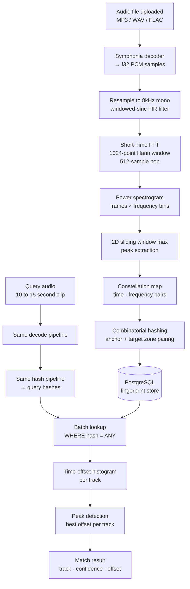

# Auris

A self-hostable audio recognition engine built in Rust. Upload your own songs to build a fingerprint library, then identify any audio clip or live recording against it — in under 500ms.

Auris implements the audio fingerprinting algorithm described in Avery Li-Chun Wang's 2003 paper *"An Industrial-Strength Audio Search Algorithm"* (the algorithm that powers Shazam), built from scratch in Rust with a focus on correctness, performance, and observable internals.

> **Why build your own library?**  
> Rather than scraping a music catalogue, Auris is designed as a recognition engine you own entirely. This is how broadcast monitoring tools, DJ set trackers, and content ID systems actually work in production — they operate against a known, curated library, not against every song ever recorded.

---

## Stack

| Layer | Technology | Role |
|---|---|---|
| API | Rust · Axum | HTTP server, multipart handling, routing |
| Fingerprinting | rustfft · rayon | FFT, peak extraction, hash generation |
| Audio decoding | Symphonia | MP3/WAV/FLAC → f32 samples |
| Job queue | PostgreSQL (`SELECT FOR UPDATE SKIP LOCKED`) | Background processing, crash recovery |
| Object storage | Rustfs (S3-compatible) | Raw audio file storage |
| Database | PostgreSQL + sqlx | Song metadata, fingerprint index, job state |
| Frontend | React · Vite | Upload, record, results UI |
| Infrastructure | Docker Compose | Single-command local and production deployment |

---

## How It Works

### The Full Pipeline



### Stage 1 — Decoding

Every audio file, regardless of format, is decoded into a normalized stream of 32-bit floating point PCM samples at **8kHz mono**. The 8kHz target is deliberate: the frequency range that matters for fingerprinting (~78Hz–3930Hz, the first and last 10 FFT bins are excluded to avoid edge artifacts, covering the range that survives low-quality speakers, phone calls, and room acoustics) fits entirely within the Nyquist limit of a 8kHz signal, and the reduced sample count makes every downstream computation faster.

Downsampling uses a **31-tap windowed-sinc FIR filter** with a Hamming window and a cutoff at 90% of the Nyquist frequency. The anti-aliasing filter prevents high-frequency content from folding back into the signal during downsampling, which would create phantom frequency components that corrupt the fingerprint.

### Stage 2 — Spectrogram

The resampled signal is transformed into a **power spectrogram** using the Short-Time Fourier Transform (STFT). A 1024-sample FFT window with a 512-sample hop (50% overlap) is applied across the signal. Each window is multiplied by a Hann function before the FFT to reduce spectral leakage at window boundaries.

The result is a 2D array of power values indexed by `[time_frame][frequency_bin]`, stored as a flat `Vec<f32>` for cache locality. For a 10-second clip at 8kHz this produces approximately **156 frames × 513 bins**.

FFT frames are processed in parallel using Rayon. Each thread maintains its own complex-number scratch buffer to avoid allocator contention.

### Stage 3 — Constellation Map

Not every point in the spectrogram is useful. Auris extracts **local maxima** — points that are the brightest spot within a ±5 frame × ±10 bin neighborhood. This produces a sparse set of peaks that represent the most energetically prominent features of the audio: the attack of a snare, the resona nce of a bass note, the harmonic of a vocal.

Peak detection uses a **2D sliding window maximum** computed in two linear passes (frequency axis then time axis), reducing the neighborhood scan from O(frames × bins × neighborhood) to O(frames × bins). An absolute magnitude threshold filters out peaks with magnitude below the configured threshold.

A density filter then limits peaks to the strongest 50 per 100ms window, ensuring uniform temporal coverage rather than clustering all peaks around a single loud moment.

For a 10-second query clip this produces approximately **700–900 constellation points**.

### Stage 4 — Combinatorial Hashing

Each constellation point acts as an **anchor**. Auris pairs it with up to 5 **target** points that fall within a target zone: up to 4095ms ahead in time (the maximum 12-bit delta), across a configurable frequency range. Each anchor–target pair produces one hash:

```
hash = pack(f_anchor, f_target, Δt)

[10 bits: f_anchor / 4Hz]  [10 bits: f_target / 4Hz]  [12 bits: Δt (raw ms, clamped to 0–4095)]
```

Frequencies are quantized to 4Hz resolution. The time delta is stored as raw milliseconds, clamped to 12 bits (0–4095ms).

The anchor's absolute timestamp is stored alongside the hash as `offset_ms`. This is what enables the time-offset histogram in the matching phase.

A 10-second clip with ~800 constellation points and a fan-out of 5 produces approximately **3,000–4,000 hashes**.

### Stage 5 — Matching

Matching is a four-step process:

1. **Batch lookup.** All query hashes are sent to PostgreSQL in a single `WHERE hash = ANY($1)` query against a BIGINT-indexed `fingerprints` table. The query returns `(hash, track_id, offset_ms)` rows for every stored fingerprint that shares a hash value with the query.

2. **Time-offset histogram.** For each returned row, Auris computes `Δ = db_offset_ms - query_offset_ms`. This delta represents how far into the stored track the query clip was sampled from. Votes are accumulated in a `HashMap<(track_id, Δ), count>`.

3. **Peak detection.** The histogram bin with the highest vote count per track is the match candidate. A sharp peak (many hashes agreeing on the same Δ) indicates a genuine match. A flat histogram (votes spread across many Δ values) indicates noise or no match.

4. **Thresholding.** Candidates with fewer than 10 agreeing hashes are discarded. Results are ranked by match count and the top 5 are returned.

---

## Algorithm Behavior & Boundaries

Auris was validated using a suite of programmatically generated audio variants. Understanding which variants it handles — and which it doesn't — is more useful than a simple pass/fail claim.

### Test Sample Generation

The test suite is generated with a Python script using FFmpeg. Given one or two source tracks, it produces six variants:

| File | Transformation | What it tests |
|---|---|---|
| `clean_target.mp3` | 15s clip from 0:30, clean or equal mix | Baseline |
| `var_noise.mp3` | + white noise at 20% amplitude | SNR robustness |
| `var_fast.mp3` | `atempo=1.10` (10% speed increase) | Time-scaling tolerance |
| `var_muffled.mp3` | Low-pass filter at 1000Hz | Frequency loss robustness |
| `var_phone.mp3` | Bandpass 300–3000Hz + +6dB gain | Telephone / room acoustics |
| `shazam_test_bar.mp3` | Speed up + noise + echo + bandpass | Worst-case combined |

```bash
# Single track variants
uv run generate_samples.py song.mp3 --out ./test_samples

# Mixed track variants  
uv run generate_samples.py song_a.mp3 --song2 song_b.mp3 --out ./test_samples
```

### What Works

**Noise robustness.** White noise at 20% amplitude does not prevent identification. The constellation map retains the strongest spectral peaks even under significant additive noise, since random noise distributes its energy across all frequency bins rather than concentrating at specific frequencies.

**Muffled / telephonic audio.** Low-pass filtering at 1000Hz removes high-frequency content but leaves the low-frequency fingerprint intact. The algorithm identifies `var_muffled.mp3` and `var_phone.mp3` reliably because the surviving frequency range still produces a consistent constellation.

**Worst-case combined (below 10% speed change).** The `shazam_test_bar.mp3` variant applies speed change, noise, echo, and bandpass filtering simultaneously. Auris identifies the source track as long as the speed change stays below the 10% threshold described below.

## Algorithm Behavior & Boundaries

### Single track — all variants identified

For a single track, Auris identifies the source across all six
variants including the worst-case combined transform. The
constellation map retains the strongest spectral peaks even
under significant noise, because random noise distributes its
energy uniformly across frequency bins rather than concentrating
at the specific peaks the fingerprint depends on.

The 10% speed increase (`var_fast.mp3`) sits at the edge of
reliable identification. At exactly 10%, the time delta Δt
between anchor and target peaks shifts by 10%, nudging hash
values into adjacent quantization buckets. Enough hashes still
match to cross the threshold. Above 10%, the histogram disperses
and identification fails — this is a fundamental property of the
scheme, not a tunable parameter.

### Mixed tracks — dominant track identified in the hard case

When two tracks are mixed at equal volume without any speed
change (`clean_target.mp3` in mix mode), Auris identifies
both tracks.

The interesting case is `shazam_test_bar.mp3` with two mixed
tracks — speed up, noise, echo, and bandpass applied
simultaneously. Here Auris identifies only the **dominant
track**: whichever track contributes more energy in the
300–3000Hz frequency range that survives the bandpass filter.

For example, mixing a rap track with heavy bass against a piano
track: the bass-heavy track produces stronger constellation
peaks at low frequencies, accumulates more histogram votes, and
wins. The piano track's hashes are present but do not
individually reach the match threshold. This is not a failure
mode — it is the correct behavior of an energy-based peak
detector under a constrained SNR budget.

Mixed tracks + speed change above 10% cannot be identified.
The speed change disperses the histogram for both tracks
simultaneously, and neither reaches the vote threshold.

### Security model

Auris does not implement user authentication. It is designed to
run as an internal API behind a reverse proxy (nginx, Traefik,
Caddy) that handles identity at the network boundary. CORS is
restricted to the frontend origin, so the API is not callable
from arbitrary clients in a browser context. Adding per-user
JWT authentication would require an Axum middleware layer and a
`users` table — the fingerprinting logic is entirely unaffected.

---

## Setup

### Development

Requirements: Docker, Rust toolchain, pnpm.

```bash
# setup environement variable
mv .env.example .env
# frontend only needs public Vite variables
printf 'VITE_API_URL=http://localhost:8000\n' > frontend/.env
# start the backing services (database and storage)
docker compose up postgres rustfs
# run migrations 
sqlx database setup
# start backend servers 
cargo watch -q -c -x " run -- --execution-mode=api" # launch the api 
cargo watch -q -c -x " run -- --execution-mode=worker" # launch the worker  
# lauch the frontend
pnpm dev
```

- API: `http://localhost:8000`
- Frontend: `http://localhost:5173`
- RustFS console: `http://localhost:9000`


### Production

The CI pipeline builds the backend and frontend as separate
container images. The production `compose.yml` pulls
those images rather than building from source.

```bash
docker compose up -d
```

Horizontal scaling requires no structural changes: the Postgres
job queue is multi-consumer safe via `SKIP LOCKED`, and all
fingerprint lookups are stateless database queries. Add a load
balancer in front of multiple backend replicas and the system
scales without modification.

---

## API Reference

| Method | Endpoint | Description |
|---|---|---|
| `POST` | `/tracks` | Register a new track (returns job ID) |
| `GET` | `/tracks` | List tracks with pagination |
| `GET` | `/tracks/:id` | Get track metadata |
| `GET` | `/tracks/:id/url` | Get presigned Rustfs URL |
| `GET` | `/jobs/:id` | Poll job status |
| `PATCH` | `/tracks/:id` | Edit track metadata |
| `POST` | `/identify` | Identify a 10 to 15 seconds audio clip |
| `DELETE` | `/tracks/:id` | Delete a track|
| `GET` | `/health` | Get health stats|

---

## Acknowledgements

This project is an implementation of the algorithm described in:

> Wang, A. L.-C. (2003) [An Industrial-Strength Audio Search Algorithm](https://www.ee.columbia.edu/~dpwe/papers/Wang03-shazam.pdf).
